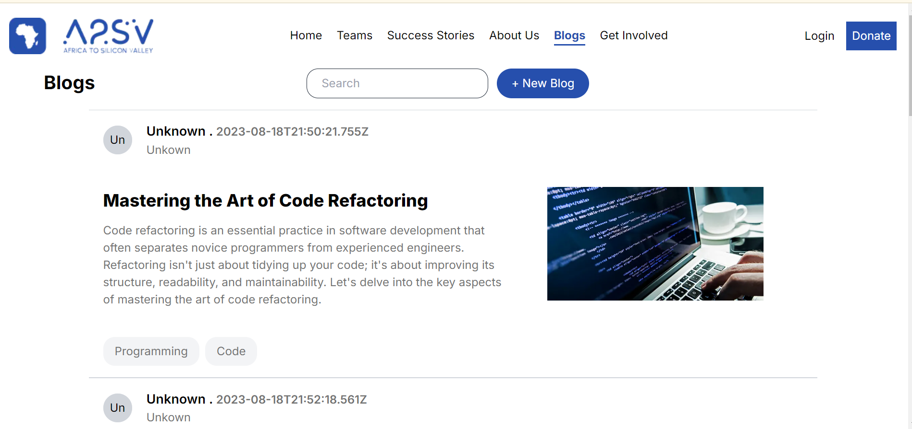
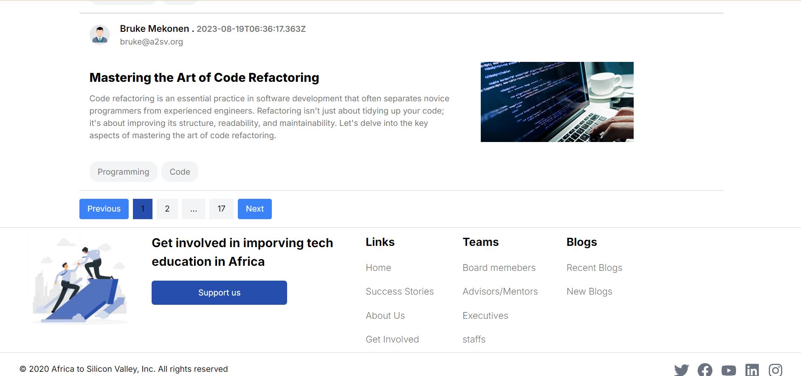
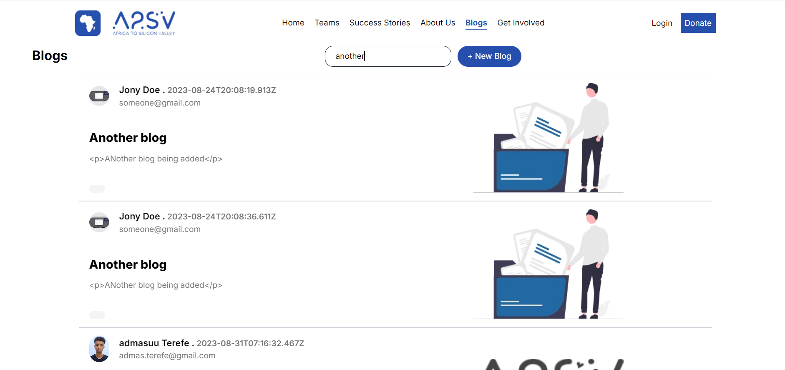
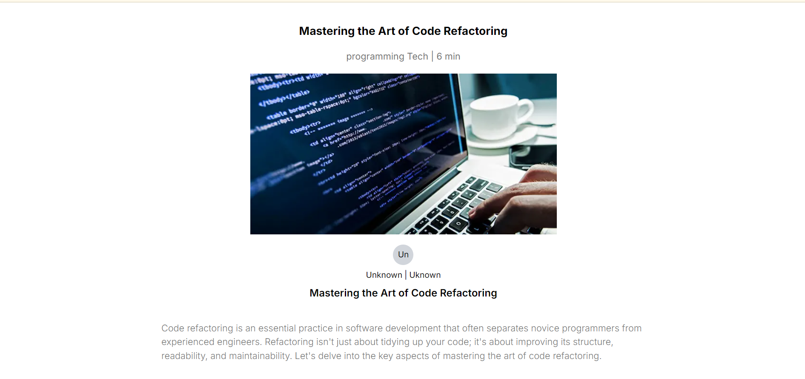
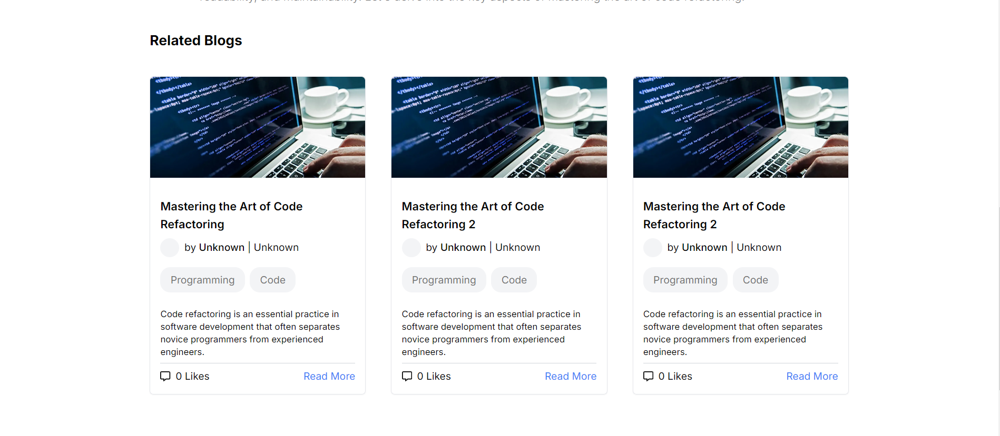

Blog Application
Welcome to the Blog Application! This project is a blog management system that includes search, pagination, and detailed blog reading features. Users can search for blogs, navigate through pages of blog entries, and click on individual blogs to read their full content.

### Vercel Link 
https://g5-web-assessment-seven.vercel.app/blogs

## Images
# Image of blogs page

# image of searched products

# image of the deatils page

## Features
Search Functionality: Users can search for blogs by keywords.
Pagination: Blogs are paginated to display a manageable number of entries per page.
Detailed View: Clicking on a blog entry provides detailed information about the blog.
Tech Stack
Frontend: Next.js, React, TypeScript, Tailwind CSS
## Installation
Follow these steps to get the project up and running on your local machine.

Prerequisites
Node.js (>= 16)
npm or yarn

1. Clone the Repository
2. install dependenices
3. run the project

## Usage
Search Blogs: Use the search bar to find blogs by keywords.
Pagination: Navigate through the pages of blog entries using pagination controls.
Read Detailed Blog: Click on any blog entry to read its detailed content.
## Contributing

Contributions are welcome! If you have suggestions or improvements, please follow these steps:

Fork the repository.
Create a new branch (git checkout -b feature/your-feature).
Commit your changes (git commit -am 'Add new feature').
Push to the branch (git push origin feature/your-feature).
Open a pull request.

## Acknowledgments
Next.js for the powerful React framework.
Tailwind CSS for the utility-first CSS framework.
React for building user interfaces.